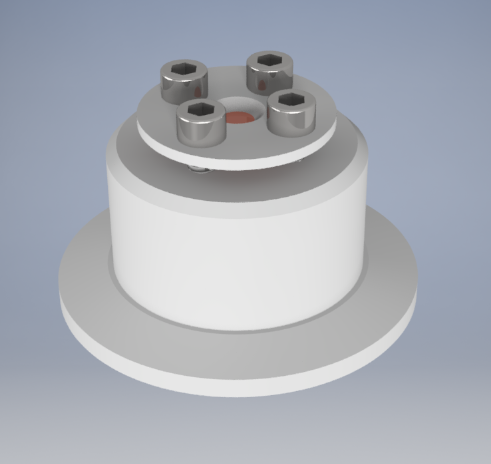

# septa-flange
Vacuum flange for controlled introduction of chemicals into vacuum systems

The parts, files and idea behind this project come from the [Patterson Group](https://pattersongroup.physics.ucsb.edu/) at UC Santa Barbara.

### Parts

[Three layer GC Septa](https://www.hamiltoncompany.com/laboratory-products/gc-septa/three-layer-gc-septa) from the Hamilton company.
The Patterson group uses part number 76007.
